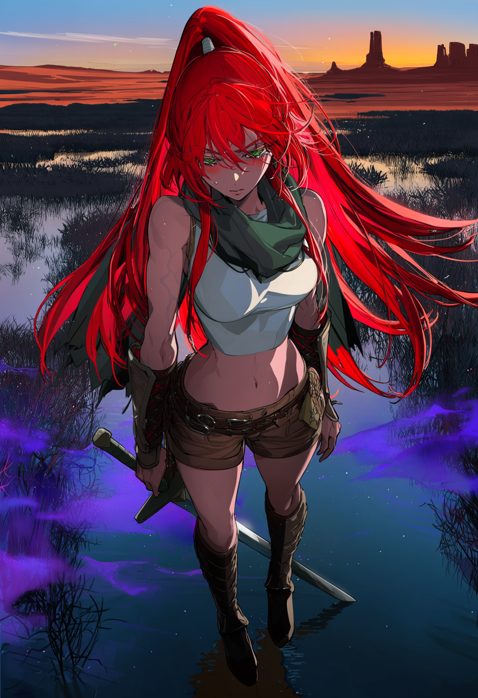
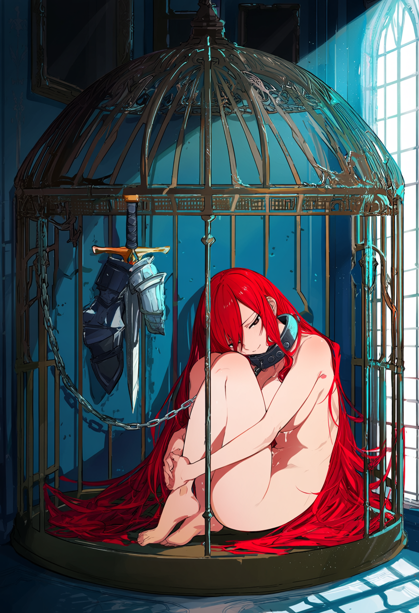
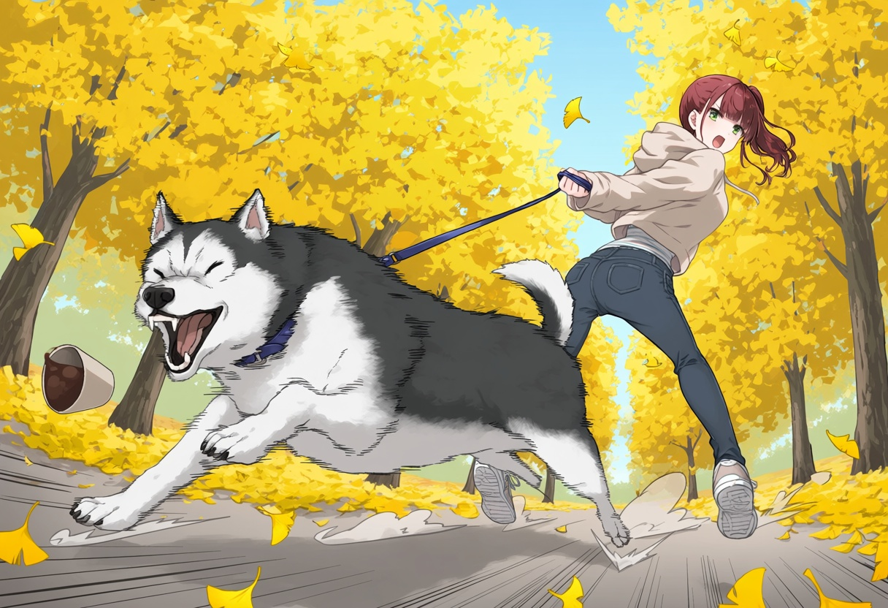
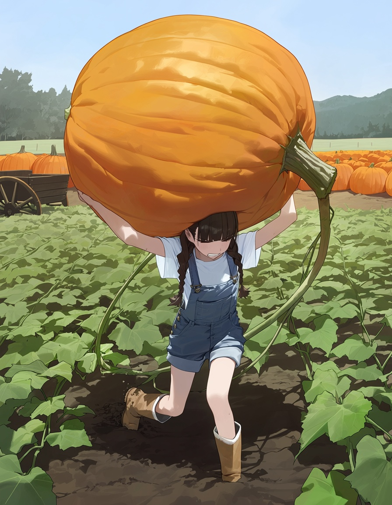
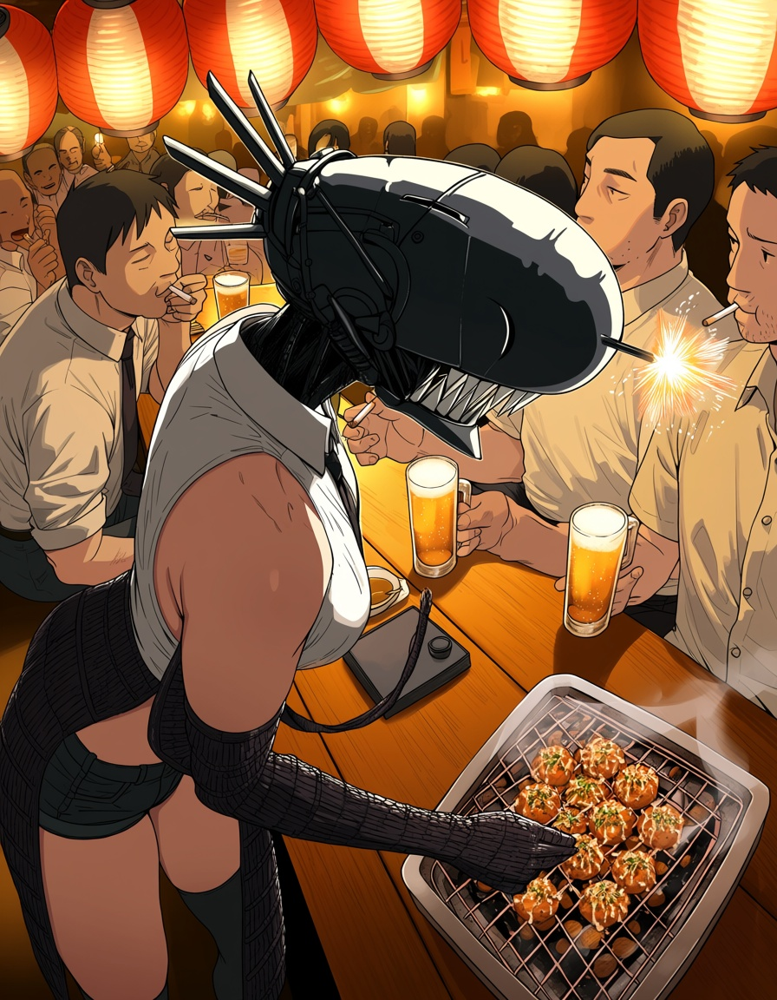
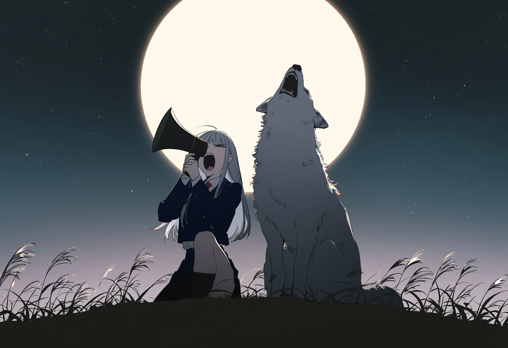
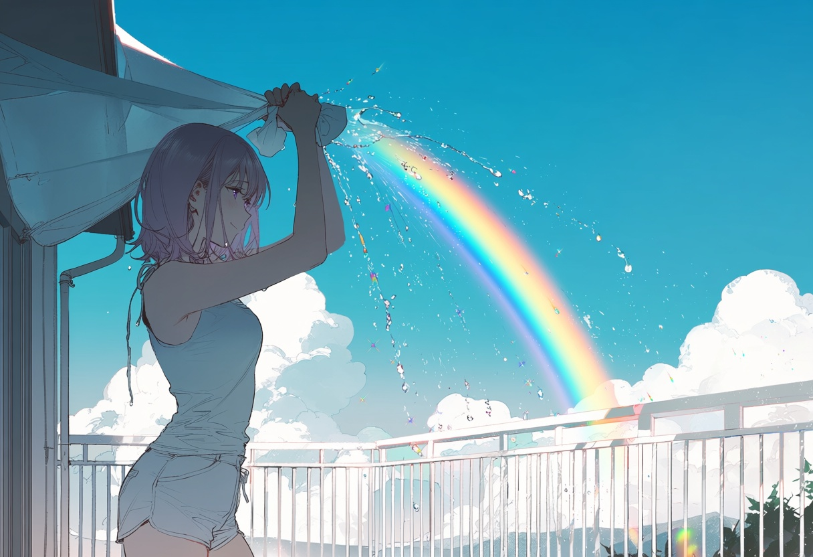
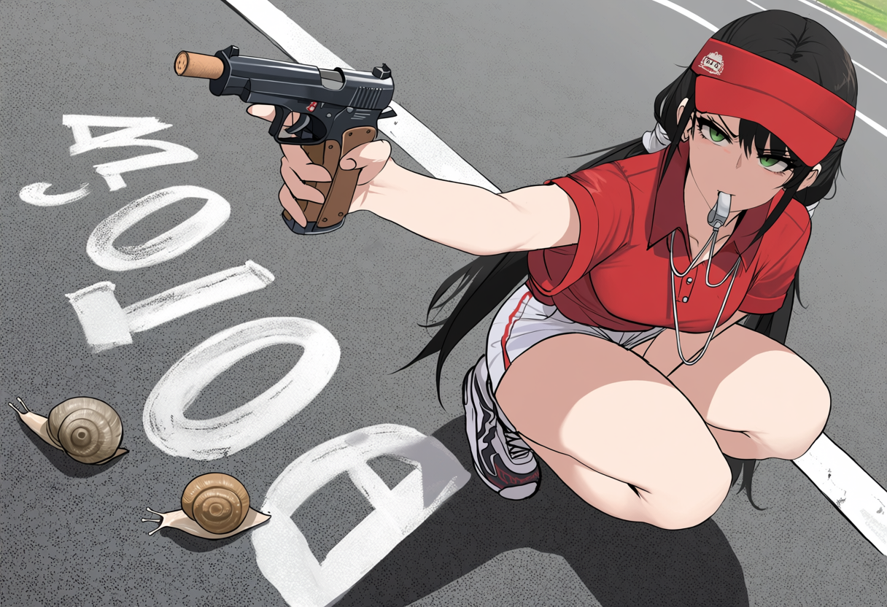
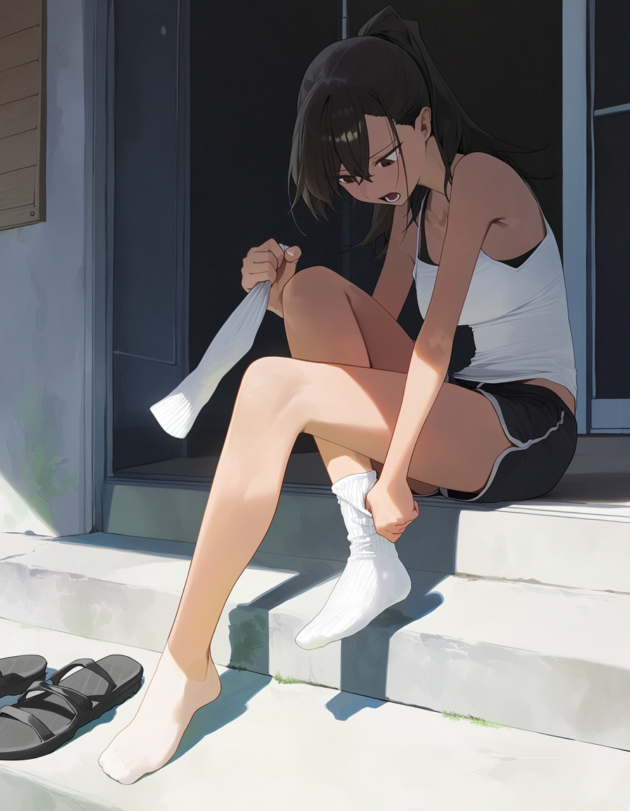

# comfy-anima-skill-share
This is an anima skill share
# Anima Prompt Skills

Systematic prompt-engineering skills for the **Anima** anime image model (circlestone-labs/Anima) — a family of 4 skills covering single-image prompting, NSFW deconstruction, long-form doujin storyboarding, and scene/background art.

为 **Anima** 动漫图像模型（circlestone-labs/Anima）编写的系统化提示词方法论 skill 集（根目录为 second 分享版，共 4 个 skill；**`v4/` 目录为第四版（V4.1），共 6 个 skill，见下文 [Version 4](#-version-4-fourth--第四版--v4)**），覆盖单图提示、NSFW 色气解构、长篇黄漫分镜、场景/背景绘制、呈现层方法论与工作流约定。

> **⚠️ 18+ 成人内容警告 / Adult Content Warning**
> 本仓库含 **NSFW / 成人 / 露骨性内容**的提示词方法论（`anima-nsfw-prompt`、`anima-doujin-plan`，v4 同样适用）。仅限成年人使用。使用者在下载、使用、转发本内容时须自行承担全部责任并遵守所在地法律。
> This repository contains **NSFW / adult / explicit sexual content** prompt methodology. For adults only. Users are solely responsible for compliance with local laws.

---

## 🆕 Version 4 (fourth) / 第四版 — `v4/`

本仓库现含两代内容：**根目录 = second 分享版（4 个 skill，保留不动）**；**`v4/` = 第四版（V4.1，6 个 skill，当前主线，推荐使用）**。

## 为什么写这套 skill / 创作缘由

我不会写复杂提示词，也不懂光影、构图、分镜这些视觉基本功，甚至连“这个主题怎么写才有趣”都很难凭空想出来。Anima 这类模型又对这些细节敏感——只写「a beautiful girl」它会自由发挥到完全失控。

所以我换了条路：**不写提示词，写意图拆解的方法**。

- **anima-prompt**：把「为什么要画这张、画面靠什么记住、每个维度写什么具体值」拆成可推导的问题，而不是背模板。三条公理（组装式模型/强先验吞弱信号/字面化一切）是从实测里总结的行为模型，所有纪律都是它们的推论。
- **anima-change**：在意图拆解后、落笔前，专门回答「这一帧凭什么被记住」——先推这帧的吸引力（核心 → 基线预期 → 一次得体违反 → 视觉交点），再决定呈现。参考图在场时切换成保真提取模式。
- **附带的风格参考**（workflow 里的 dialogue-style、change 里的 style-light）：都是同思路——不写“应该怎么写”，写“哪些做法已经实测翻车、哪些红线不能碰”，留出发挥空间。

这套东西的价值不在提示词本身，在于**让一个不会画画、不会写文案的人，也能通过拆解方法做出不千篇一律的图**。希望对有同样困扰的人有点参考。

## 例图 / Gallery

以下均为本套 skill 生成的实际作品（各项目精选，含 doujin、pixiv 叙事、拍卖剧情、日常喜剧、月光场景等）：

| | | |
|---|---|---|
|  |  |  |
|  |  |  |
|  |  |  |
|  |  |  |
|  | | |

### 第四版六个 skill

| Skill | Purpose / 用途 |
|---|---|
| `anima-prompt` | 提示词层权威主线（第四版重写：公理化纪律体系） |
| `anima-nsfw-prompt` | NSFW 解构方法论补充 |
| `anima-doujin-plan` | 长篇（>10p）分镜层权威主线 |
| `anima-scene-prompt` | 纯场景/背景/环境 |
| `anima-change` | **新增**：呈现层方法论——"这一帧凭什么被记住"（预期 + 一次得体违反；参考图复刻/对标保真提取） |
| `anima-workflow` | **新增**：工作流约定——文件分类、对比测试（主题/人物/种子三一致）、自动化迭代、读图审计、长篇对话框压字交付（三档对白文风参考见 `references/`）、出图踩坑速查 |

### 相比 second 版的更新说明 / What's new vs the root (second) version

1. **新增两个 skill**（second 为四件套）：`anima-change`——呈现层方法论，先推导这一帧的吸引力（核心→基线预期→一次得体违反→视觉交点），再落呈现；含"强载体/弱载体"判别式、禁区与反模式清单、参考图复刻模式。`anima-workflow`——工作流约定，覆盖跑批/对比/自动化/长篇交付的全流程规则，重点是长篇对话框压字交付（按 safe/sensitive/nsfw 三档分篇的对白文风参考）与出图踩坑速查。
2. **提示词纪律体系公理化重构**：second 版的散装规则在第四版收敛为三条核心公理（**组装式模型 / 强先验吞弱信号 / 字面化一切**）的推论体系——规则可推导而非死记；并新增"拼尸块"硬纪律、Tier 0 单帧可读性、clip token 预算（正面 ~150-300 词 / 负面 ~60-120 词，砍词优先级）。
3. **跨页一致性成体系**：人物块两段式（公开角色"名字即锚" vs OC 全维度固定块）、服装状态机与移除双锚定、道具三档分类（L0 身份符号 / L1 手持 / L2 环境）与生命周期、视线逐页单选、多角色防串角与 faceless 强度层级。
4. **长篇分镜层大幅深化**：12 列分镜表、情绪×色气双曲线节奏、状态进度条与单调累加器、符号标签状态机、需求→剧本→分镜四阶段转义与三组自检清单。
5. **ComfyUI 执行层完善**：Aesthetic / Turbo / Base 参数分治（含 Turbo CFG 1.0 硬约束）、NegPip 正面负权重机制、filename_prefix 命名规范与对比轮管理、API 提交流程（probe / submit / poll / verify）。
6. **负面提示词体系深化**：NEG_CORE/SAFE/NSFW/EXPL 档位基线 + 问题预测追加表 + 正负冲突扫描 + 删误杀项 + 排空纪律。
7. **目录结构**：second 为根目录平铺文件；v4 按 skill 分文件夹（`v4/<skill-name>/SKILL.md`），可直接整文件夹放入 agent skills 目录。

**V4.1（本次）**：保留画师策略全部内容（画师-气质映射、组合纪律、题材→画师速查、先单画师规则）；补充 anima-change 的轻松向风格参考（`references/style-light.md`）；workflow 升级到 v1.3（轮次纪律、批量提交、服务器运维、点子库使用）；仅移除本地路径/硬件/日期统计，其余实测结论与画师数据全部保留。

### 脱敏说明 / Sanitization

第四版分享稿（V4.1）**移除了本地环境信息**：本机路径（D盘/E盘/个人工具脚本）、junction 单主本说明、硬件型号、带日期的实验统计、内部项目语境、点子库具体路径。画师策略、负面预测表、一致性纪律、ComfyUI 参数、各版本实测结论等通用内容全部保留。

---

## What this is / 这是什么

Anima (circlestone-labs/Anima) is an open anime-focused text-to-image DiT model. Writing good Anima prompts well requires model-specific knowledge: tag syntax, prompt structure, negative-prompt strategy, character consistency, artist strategy. This repo packages that knowledge as **methodology + reusable rules**, not as a copy-paste example gallery.

Anima（circlestone-labs/Anima）是开源的动漫向文生图模型。写出好的 Anima 提示词需要模型特化知识：tag 语法、提示词结构、负面策略、人物一致性、画师策略。本仓库把这类知识整理为**方法论 + 可复用规则**，而不是堆砌可照抄的例句。

- **Methodology over examples / 方法论优先于例句**：每个 skill 给出"如何思考/如何拆解"，可泛化到任意新案例，而非要求照抄某个案例。
- **Intent-driven / 意图驱动**：先解构"为什么色/要表达什么"，再决定视觉、模板、负面。

## Skills / 四个 skill

| Skill | Purpose / 用途 |
|---|---|
| `anima-prompt` | Core single-image prompting: intent analysis, templates A/B/C, intent-based negative system, character consistency, artist strategy, ComfyUI params. 核心单图提示词：需求拆解、模板 A/B/C、意图负面、人物一致性、画师策略、参数。 |
| `anima-nsfw-prompt` | NSFW deconstruction supplement: erotic-core analysis (find-core → innovate), event-to-visual-anchor derivation, atmosphere tips, common pitfalls. NSFW 特化补充：色气核心分析法、事件→视觉锚点推导、氛围技巧、常见坑。 |
| `anima-doujin-plan` | Long-form doujinshi (>10p) script & storyboard design: story arcs, event chains, beats, camera language, template allocation, storyboard-table output. 长篇黄漫（>10p）剧本与分镜设计：分幕、事件链、节奏、镜头语言、模板分配、分镜表产出。 |
| `anima-scene-prompt` | Pure scene / background / environment art. 纯场景/背景/环境绘制。 |

**Skill hierarchy / 职责边界**：
- `anima-prompt` is the core — all templates/negatives/tags live there.
- `anima-nsfw-prompt` supplements the NSFW fragment inside `anima-prompt` (not a separate router).
- `anima-doujin-plan` plans *what to draw* for long-form; `anima-prompt` writes *how to express* each page.
- `anima-scene-prompt` routes pure scenes (no main character).

## Requirements / 依赖

- **Anima** model (open-source, see [circlestone-labs/Anima](https://huggingface.co/circlestone-labs/Anima)); any of Aesthetic / Turbo / Base variants.
- A local **ComfyUI** installation (Anima has native support in recent ComfyUI).
- These are skill files (markdown instruction packs) for an AI agent (e.g. Claude Code `~/.claude/skills/`); place each under your agent's skills directory and invoke by name.

这些是给 AI 智能体（如 Claude Code）的 skill 文件（Markdown 指令包），放入 `~/.claude/skills/<skill-name>/SKILL.md` 后按名调用。

## Usage / 使用

1. Single image: invoke `anima-prompt` (add `anima-nsfw-prompt` for NSFW, `anima-scene-prompt` for pure scenes).
2. Long-form doujinshi (>10p): invoke `anima-doujin-plan` first for script/storyboard, then `anima-prompt` to write per-page prompts.
3. Each skill is self-contained — read the skill, follow its methodology top to bottom.

## Notes / 说明

- Prompt weighting, artist tags (`@name`), and negative strategy are Anima-specific — verified through iteration, not guessed.
- Negative templates are provided in full (CORE/SAFE/NSFW/EXPL) — intent-based additions are described in each skill.

## License / 许可证

MIT — see [LICENSE](LICENSE). The methodology and text are free to use, modify, and redistribute with attribution-free MIT terms.
